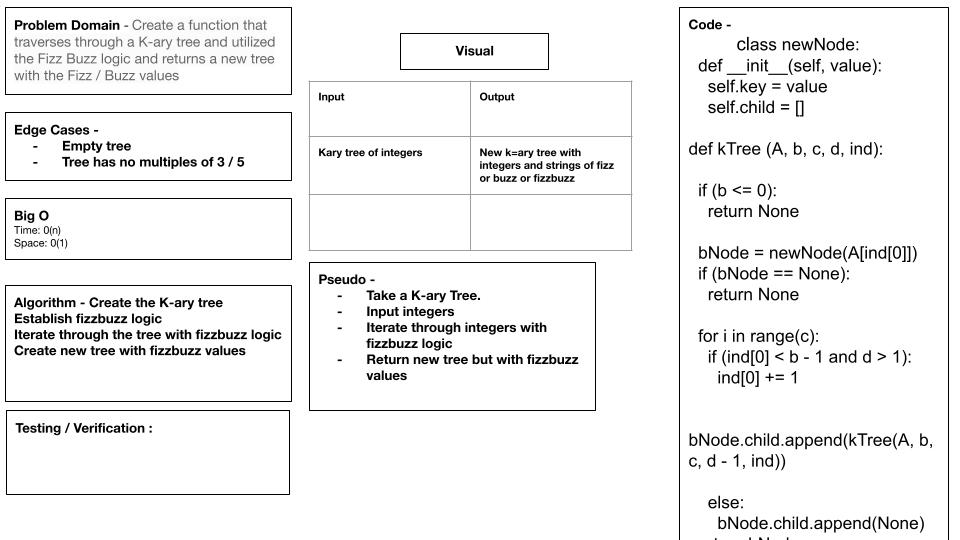

# Trees
Binary Trees' are simply left right down node data, If you have data to the left, Go left if you have it to the right go right, up - up, down - down

## Challenge
traverse through a binary tree using fizz buzz logic. 

## Approach & Efficiency
Simplified. Quickist route to complete.

## 

pull request == 

https://github.com/Williamsjanthony15/data-structures-and-algorithms/pull/31

