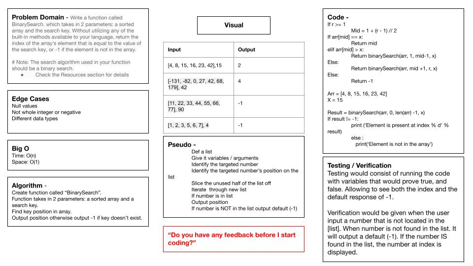

## code Challenge 3

Code Challenge 2 was white board, the white board is requiring an array taken as an input and output the array but with the given number inserted in the middle.

I worked on this with Kevin Henry, Marie Marcos

The image is of the Whiteboard along with the code. The code was written on Google Draw.

## 
https://github.com/Williamsjanthony15/data-structures-and-algorithms/pull/16
