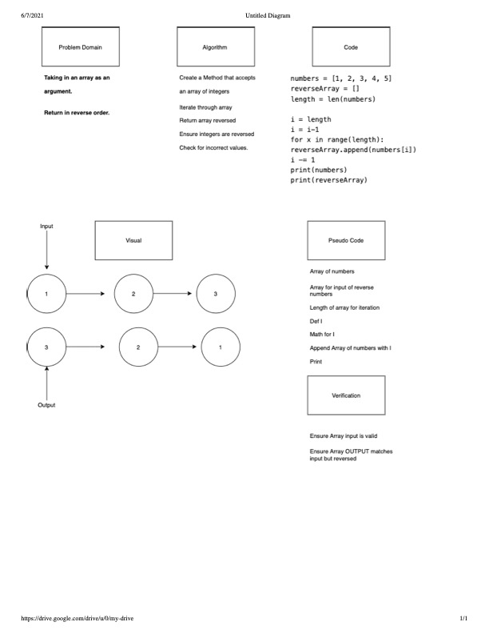
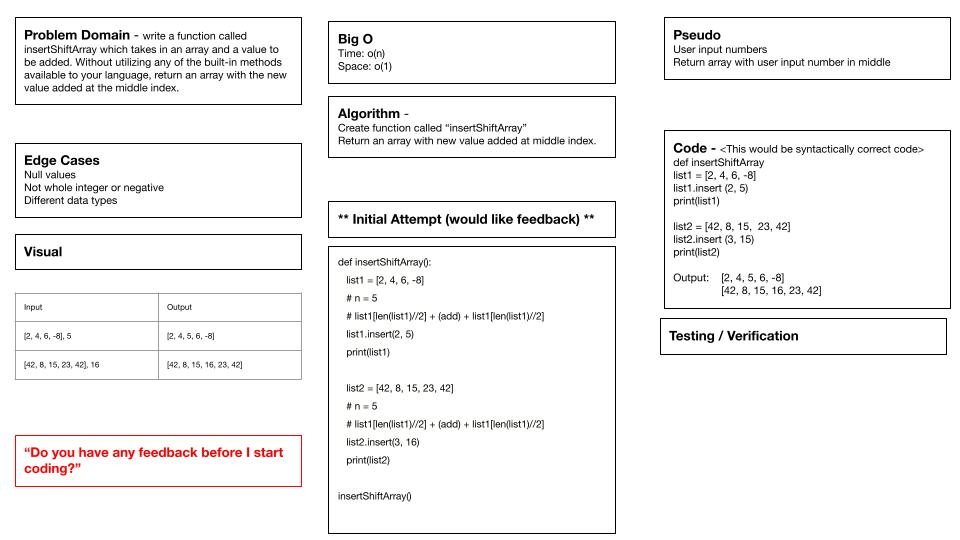

# Code Challenge 1

Code Challenge 1 was an inital white board, the white board is requiring an array taken as an input and output the array but reversed.

I worked on this with Glen Clark.

The image is of the Whiteboard along with the code. The code was initally written on Repl. where it was also verfied for functionality.

## 

## 
https://github.com/Williamsjanthony15/data-structures-and-algorithms/pull/16
