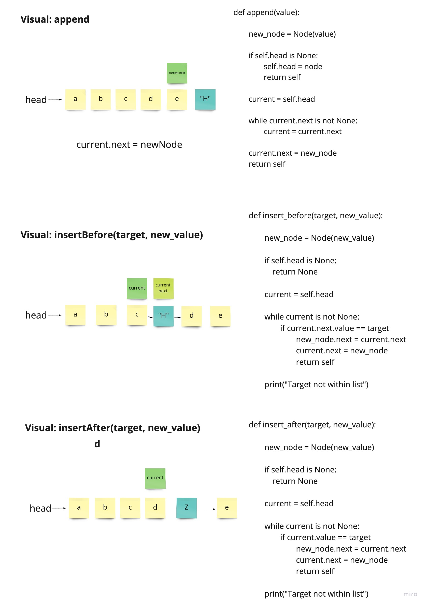
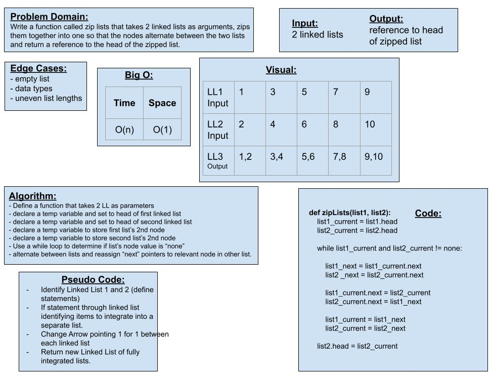

## code Challenge 6

Code Challenge 6 writing a few functions and tests for linked lists, insert and append

I worked on this with Matt Santorsola, and Davee Sok

The image is the visuals for insert - before, after and append.

## 
https://github.com/Williamsjanthony15/data-structures-and-algorithms/pull/18

Colab - Michael and Tony.

## [Code Challenge 7]
https://github.com/Williamsjanthony15/data-structures-and-algorithms/pull/21

## 
